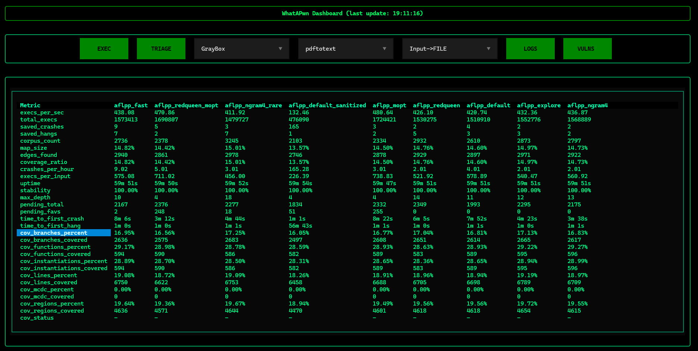
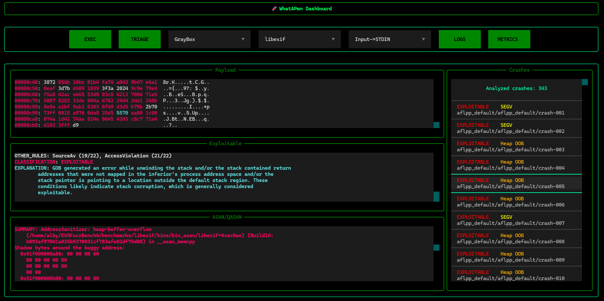

# WhatAPwn

**WhatAPwn** is a plug-and-play parallel fuzzing platform designed for automated vulnerability discovery on Intel ELF binaries.  
It enables scalable, reproducible fuzzing campaigns by orchestrating multiple fuzzers across different targets, providing benchmarking capabilities, and integrating triaging and analysis pipelines.




---

## Features

- **Parallel fuzzing orchestration** across multiple targets  
- **Plug-and-play architecture** for easy fuzzer integration  
- Built on **AFL & AFL++ fuzzers**  
- **Automated crash triaging** using sanitizers and GDB plugins
- **Benchmarking support** with real-world vulnerable targets
- **Reproducible environments** via Docker  
- **Coverage-driven evaluation** via LLVM 

---

## Project Structure

```bash
WhatAPwn/
│── benchmarks/         # Benchmark targets
    │── libexif
    │── pdftotext
│── fuzzers/            # Fuzzer integrations (AFL++, AFLGo, etc.)
    │── aflgo
    │── aflpp
    │── ecofuzz
    │── ...
│── dashboard/          # Platform's TUI files
│── triaging/           # Crash analysis and exploitability checks
    │── qasan/             # QASAN's Dockerfile
    │── exploitable        # Exploitable plugin main's directory (https://github.com/jfoote/exploitable)
│── run_fuzzers.py      # Main orchestrator script
│── fuzzing_config.yaml
```

---

## Setup

Before starting, make sure you have **Docker** and **Python 3.8+** installed.

### 1. Clone the repository and install dependencies:

```bash
git clone https://github.com/albepe01/WhatAPwn.git
cd WhatAPwn
pip install -r requirements.txt
```

### 2. Install required libraries for benchmarking and triaging:

```bash
sudo apt-get update
sudo apt install xxd llvm-profdata llvm-cov
# Build the container for QASAN in the triaging/qasan/ folder
docker build -t qasan .
```

---

## Fuzzing Setup

To fuzz a binary, create a directory with a specific structure under the `benchmarks` directory. The structure should look like this:

```bash
benchmarks/
  └── <binary_name>/
      ├── bin_original/   # Original binary
      ├── bins/           # Instrumented binaries (AFL, AFL++, ASAN, etc.)
      ├── seeds/          # Fuzzing seeds
      ├── dictionary/     # Dictionary for fuzzing
      ├── src/            # Source code and dependencies (e.g., dependencies.txt)
```

### Instrumenting a Binary

You can instrument a binary for AFL, AFL++, CMPLOG by running:

```bash
python3 compilers/init.py program
python3 compilers/init_cov.py program  # For coverage measurement
```

---

## Usage

To configure the fuzzing campaigns, edit the `fuzzing_config.yaml` file for each fuzzing instance. You can then start a fuzzing campaign using the orchestrator script:

```bash
python3 run_fuzzers.py
```

To fuzz a specific binary (e.g., `libexif`), use:

```bash
python3 run_fuzzers.py libexif
```

### Available Flags

- `--file` : Used for programs that take input from a file instead of stdin.
- `--qemu` : Enables QEMU mode to fuzz without relying on source code.

The orchestrator also allows running fuzzers independently. To run the triaging process for a target, navigate to the `triaging` directory and run:

```bash
cd triaging
python3 run_triage.py
```

Alternatively, manage operations directly via the platform’s TUI:

```bash
python3 -m dashboard.app
```

---

## Benchmarks

The platform has been validated on real-world vulnerable targets from the **Fuzzing101** suite, including:

- **Xpdf** — CVE-2019-13288  
- **libexif** — CVE-2009-3895, CVE-2012-2836  

These results demonstrate the ability to **reproduce real-world vulnerabilities automatically**.

---

## Extending the Framework

To add a new fuzzer, follow these steps:

1. Create a new module in the `fuzzers/` directory.
2. Implement the runner interface.
3. Register it in the orchestration pipeline.

---

## Future Work

This project is still under development. We are continuously working on improvements and plan to add the following features:

- Support for **non-ELF targets**  
- **Distributed fuzzing** across multiple machines  
- Integration with **symbolic execution tools**  
- Enhanced **exploitability classification**

---

## Contributions

As a thesis project, **WhatAPwn** is evolving with a focus on continuous improvement. Future updates will include:

- Support for non-ELF targets  
- Distributed fuzzing across multiple machines  
- Integration with symbolic execution tools  
- Enhanced exploitability classification  
- A better user experience

**Contributions are welcome!** Feel free to open issues or submit pull requests.

---

## License

This project is licensed under the MIT License - see the [LICENSE](LICENSE) file for details.
